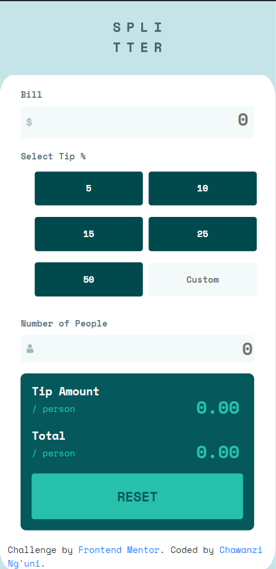

# Frontend Mentor - Tip calculator app solution

This is a solution to the [Tip calculator app challenge on Frontend Mentor](https://www.frontendmentor.io/challenges/tip-calculator-app-ugJNGbJUX). 

## Overview

### The challenge

Users should be able to:

- View the optimal layout for the app depending on their device's screen size
- See hover states for all interactive elements on the page
- Calculate the correct tip and total cost of the bill per person

### Screenshot

### Links

- Solution URL: [GitHub Repo](https://github.com/chaw-bot/TipCalculator/tree/main)
- Live Site URL: [Depoyed version](https://tip-calculator-chaw-bot.vercel.app/)

## My process

### Built with

- Semantic HTML5 markup
- CSS
- Flexbox
- CSS Grid
- Mobile-first workflow
- Vanilla JavaScript

## Getting started
To get a local copy up and running follow these simple example steps.

### Prerequisites
- Gitbash installed to navigate between the branches.
- A preferred text editor for example VS Code.

### Install
Clone this [GitHub Repo](https://github.com/chaw-bot/TipCalculator.git) to your computer on yourFolder by typing these commands in the terminal or download as a Zip file and extract.

$ mkdir yourFolder

$ cd yourFolder

$ git clone https://github.com/chaw-bot/TipCalculator.git

👤 **Author**

- Frontend Mentor - [@chaw-bot](https://www.frontendmentor.io/profile/chaw-bot)
- GitHub: [@chaw-bot](https://github.com/chaw-bot)
- Twitter: [@chaw36422087](https://twitter.com/chaw36422087)
- LinkedIn: [Chawanzi Ng'uni](https://www.linkedin.com/in/chawanzi-ng-uni-449328212/)

## Acknowledgments

Hat tip to [Frontend Mentor](https://www.frontendmentor.io/solutions) for the challenge and the template provided.

## Contributors

Thank you, [Beardless-sheik](https://github.com/Beardless-sheik) for your contribution. 😃

## 🤝 Contributing

Contributions, issues, and feature requests are welcome!

Feel free to check the [issues page](https://github.com/chaw-bot/TipCalculator/issues).

## Show your support

Give a ⭐️ if you like this project!

